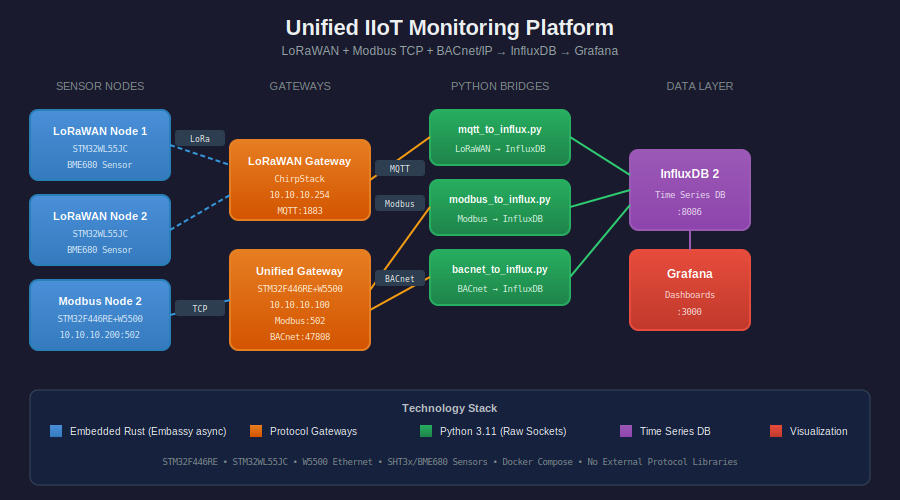

# Unified IIoT Monitoring Platform

A complete Industrial IoT monitoring solution combining **LoRaWAN**, **Modbus TCP**, and **BACnet/IP** protocols into a unified Grafana dashboard. Built with embedded Rust firmware and Python data collectors.

<p align="center">
  
</p>

> This project evolved from [wk11-unified-monitoring](https://github.com/mapfumo/wk11-unified-monitoring), extending it with BACnet/IP support and consolidating all firmware into a single repository.

## Features

- **Multi-Protocol Support** - LoRaWAN, Modbus TCP, and BACnet/IP on a unified platform
- **Embedded Rust Firmware** - Embassy async runtime on STM32 microcontrollers
- **Pure Socket Implementations** - No external protocol libraries (educational focus)
- **Docker Infrastructure** - InfluxDB, Grafana, and Mosquitto with one command
- **Auto-Provisioned Dashboards** - Grafana dashboards ready out of the box

## Prerequisites

### Software

| Requirement | Version | Installation |
|-------------|---------|--------------|
| Docker & Docker Compose | Latest | [docs.docker.com](https://docs.docker.com/get-docker/) |
| Rust | Latest stable | `curl --proto '=https' --tlsv1.2 -sSf https://sh.rustup.rs \| sh` |
| ARM Target | thumbv7em-none-eabihf | `rustup target add thumbv7em-none-eabihf` |
| probe-rs | Latest | `cargo install probe-rs-tools` |
| Python | 3.11+ | System package manager |

### Hardware

| Device | MCU | Protocols | IP Address |
|--------|-----|-----------|------------|
| Unified Gateway | STM32F446RE + W5500 | Modbus TCP + BACnet/IP | 10.10.10.100 |
| Modbus Node 2 | STM32F446RE + W5500 | Modbus TCP | 10.10.10.200 |
| LoRa Node 1 | STM32WL55JC | LoRaWAN | via gateway |
| LoRa Node 2 | STM32WL55JC | LoRaWAN | via gateway |

All nodes use **SHT3x** temperature/humidity sensors and **SSD1306** OLED displays.

### Network Configuration

The OT (Operational Technology) network uses subnet `10.10.10.0/24`. Ensure your host machine can reach this subnet for Modbus/BACnet communication.

## Quick Start

### Step 1: Clone and Start Services

```bash
git clone https://github.com/mapfumo/bacnet-gateway.git
cd bacnet-gateway

# Start Docker services (InfluxDB, Grafana, Mosquitto)
./start_services.sh

# Verify services are running
docker compose ps
```

### Step 2: Access the Dashboard

Open [http://localhost:3000](http://localhost:3000) in your browser.

- **Username:** `admin`
- **Password:** `admin123456`

### Step 3: Flash Firmware (Optional - requires hardware)

```bash
# Unified Gateway (Modbus TCP + BACnet/IP)
cd firmware/unified-gateway
cargo build --release
probe-rs run --chip STM32F446RETx target/thumbv7em-none-eabihf/release/bacnet-gateway

# Modbus Node 2
cd firmware/modbus
cargo build --release --bin modbus_2
probe-rs run --chip STM32F446RETx target/thumbv7em-none-eabihf/release/modbus_2

# LoRaWAN nodes (requires STM32WL55 hardware)
cd firmware/lorawan/lora-1 && cargo run --release
cd firmware/lorawan/lora-2 && cargo run --release
```

### Step 4: Start Data Collectors

```bash
# Terminal 1: Modbus TCP collector
python3 modbus_to_influx.py

# Terminal 2: BACnet/IP collector
python3 bacnet_to_influx.py

# LoRaWAN collector runs automatically in Docker (mqtt-bridge container)
```

### Step 5: Stop Services

```bash
./stop_services.sh
```

## Protocol Reference

### Modbus TCP (Port 502)

| Register | Description | Data Type |
|----------|-------------|-----------|
| 0-1 | Temperature | float32 (IEEE 754) |
| 2-3 | Humidity | float32 (IEEE 754) |
| 4 | Device Status | uint16 |
| 5-6 | Uptime | uint32 (seconds) |

### BACnet/IP (Port 47808)

| Object Type | Instance | Property | Description |
|-------------|----------|----------|-------------|
| Device | 1234 | Object_Name | "BACnet-Gateway" |
| Analog Input | 0 | Present_Value | Temperature (°C) |
| Analog Input | 1 | Present_Value | Humidity (%) |
| Analog Value | 0 | Present_Value | Uptime (seconds) |

### LoRaWAN

- **Join Method:** OTAA with automatic rejoin
- **Uplink Interval:** 30 seconds
- **Sensor:** BME680 (temperature, humidity, pressure, gas resistance)

## Project Structure

```
bacnet-gateway/
├── firmware/
│   ├── unified-gateway/          # Modbus TCP + BACnet/IP firmware
│   ├── modbus/                   # Standalone Modbus node firmware
│   └── lorawan/
│       ├── lora-1/               # LoRaWAN node 1 firmware
│       ├── lora-2/               # LoRaWAN node 2 firmware
│       ├── lora-phy-patched/     # Patched LoRa PHY library
│       └── lorawan-device-patched/
├── grafana/
│   └── dashboards/               # Auto-provisioned Grafana dashboards
├── mosquitto/
│   └── config/                   # MQTT broker configuration
├── docs/
│   └── architecture.svg          # System architecture diagram
├── bacnet_to_influx.py           # BACnet/IP → InfluxDB collector
├── modbus_to_influx.py           # Modbus TCP → InfluxDB collector
├── mqtt_to_influx.py             # LoRaWAN MQTT → InfluxDB bridge
├── mqtt_subscriber.py            # Debug tool for MQTT messages
├── docker-compose.yml            # Infrastructure services
├── start_services.sh             # Start all Docker services
├── stop_services.sh              # Stop all Docker services
└── TROUBLESHOOTING.md            # Common issues and solutions
```

## Service Endpoints

| Service | URL | Credentials |
|---------|-----|-------------|
| Grafana | [http://localhost:3000](http://localhost:3000) | admin / admin123456 |
| InfluxDB | [http://localhost:8086](http://localhost:8086) | admin / admin123456 |
| MQTT Broker | localhost:1883 | anonymous |

## Testing

### Verify Modbus TCP

```bash
# Install modbus-cli: pip install modbus-cli
modbus tcp://10.10.10.100 read 0 4
modbus tcp://10.10.10.200 read 0 4
```

### Verify BACnet/IP

Use [Yabe (Yet Another BACnet Explorer)](https://sourceforge.net/projects/yetanotherbacnetexplorer/):

1. Launch Yabe and click "Add Device"
2. Send Who-Is broadcast on your network interface
3. Device 1234 should appear
4. Browse Analog Input 0 (temperature), Analog Input 1 (humidity), Analog Value 0 (uptime)

### Verify LoRaWAN

```bash
# View decoded sensor readings from MQTT
python3 mqtt_subscriber.py
```

## Troubleshooting

See [TROUBLESHOOTING.md](TROUBLESHOOTING.md) for solutions to common issues:

- W5500 SPI communication failures (returns 0x00)
- BACnet ReadProperty parsing errors
- Embassy task arena sizing (`task-arena-size-32768`)
- LoRaWAN join failures and session management
- Docker networking issues
- probe-rs "device busy" errors

## What's New vs wk11-unified-monitoring

| Feature | wk11 | This Project |
|---------|:----:|:------------:|
| LoRaWAN nodes | ✓ | ✓ |
| Modbus TCP | ✓ (2 nodes) | ✓ (1 node + unified) |
| BACnet/IP | ✗ | ✓ |
| Unified Gateway | ✗ | ✓ |
| Single Repository | ✗ | ✓ |
| Uptime via BACnet | ✗ | ✓ |

## References

- [Embassy Framework](https://embassy.dev/) - Async embedded Rust
- [BACnet Standard (ASHRAE 135)](https://www.ashrae.org/) - Building automation protocol
- [Modbus Application Protocol](https://modbus.org/specs.php) - Industrial protocol specification
- [LoRaWAN Specification](https://lora-alliance.org/lorawan-for-developers/) - LPWAN protocol
- [W5500 Datasheet](https://www.wiznet.io/product-item/w5500/) - Hardwired TCP/IP Ethernet controller

## License

MIT
